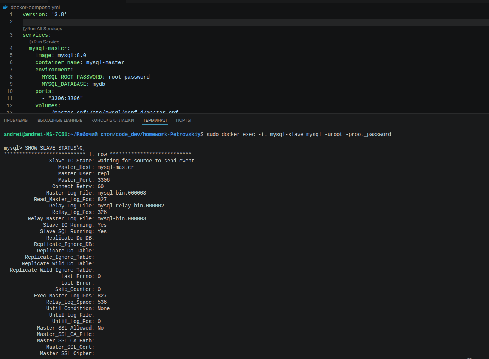
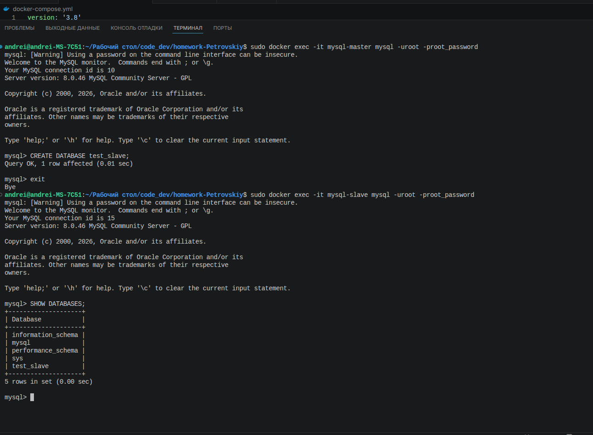

# # Домашнее задание к занятию «Репликация и масштабирование. Часть 1» Петровский А.Н

### Задание 1

На лекции рассматривались режимы репликации master-slave, master-master, опишите их различия.

*Ответить в свободной форме.*

---

 Решение 

###  Репликация — это механизм синхронизации данных между несколькими экземплярами СУБД. Ниже приведено сравнение двух основных топологий.

### 1. Master-Slave (Источник — Реплика)
Это асимметричная модель управления данными.

* **Принципы:**
    * **Master (Ведущий):** Единственный узел, принимающий запросы на изменение данных (`INSERT`, `UPDATE`, `DELETE`).
    * **Slave (Ведомый):** Получает изменения от Master и обслуживает запросы на чтение (`SELECT`).
* **Различия:**
    * **Направление потока:** Данные всегда текут строго в одну сторону (от Master к Slave).
    * **Конфликты:** Отсутствуют по определению, так как источник записи один.
    * **Назначение:** Идеально подходит для масштабирования чтения и создания резервных копий без остановки основной базы.

### 2. Master-Master (Multi-Master)
Это симметричная модель, где каждый узел обладает равными правами.

* **Принципы:**
    * Любой узел в кластере может принимать как чтение, так и запись.
    * Изменения на одном узле автоматически транслируются на все остальные.
* **Различия:**
    * **Направление потока:** Двунаправленное (Full mesh или кольцо).
    * **Конфликты:** Возможны коллизии (например, одновременное изменение одной строки на разных узлах). Требуются сложные механизмы разрешения конфликтов.
    * **Назначение:** Обеспечение высокой доступности (High Availability) на запись и отказоустойчивость при выходе из строя любого узла.

### Задание 2

Выполните конфигурацию master-slave репликации, примером можно пользоваться из лекции.

*Приложите скриншоты конфигурации, выполнения работы: состояния и режимы работы серверов.*

---

Решение

----------------------------------

Исходный код в репозитории

