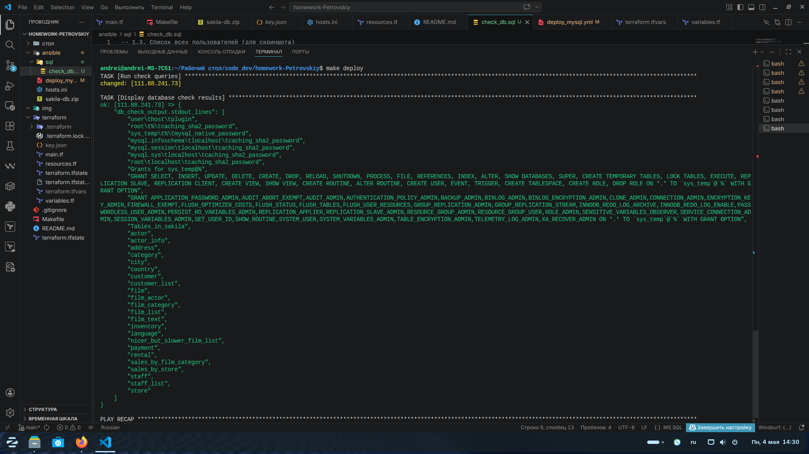

# Домашнее задание к занятию «Работа с данными (DDL/DML)» Петровский А.Н


### Задание 1
1.1. Поднимите чистый инстанс MySQL версии 8.0+. Можно использовать локальный сервер или контейнер Docker.

1.2. Создайте учётную запись sys_temp. 

1.3. Выполните запрос на получение списка пользователей в базе данных. (скриншот)

1.4. Дайте все права для пользователя sys_temp. 

1.5. Выполните запрос на получение списка прав для пользователя sys_temp. (скриншот)

1.6. Переподключитесь к базе данных от имени sys_temp.

Для смены типа аутентификации с sha2 используйте запрос: 
```sql
ALTER USER 'sys_test'@'localhost' IDENTIFIED WITH mysql_native_password BY 'password';
```
1.6. По ссылке https://downloads.mysql.com/docs/sakila-db.zip скачайте дамп базы данных.

1.7. Восстановите дамп в базу данных.

1.8. При работе в IDE сформируйте ER-диаграмму получившейся базы данных. При работе в командной строке используйте команду для получения всех таблиц базы данных. (скриншот)

*Результатом работы должны быть скриншоты обозначенных заданий, а также простыня со всеми запросами.*

<details>
<summary> Решение </summary>

## 🚀 Автоматизация (Infrastructure as Code)

В данном проекте реализован декларативный подход к развертыванию БД. С помощью **Ansible** полностью автоматизированы следующие этапы задания:

| Пункт задания | Статус | Техническая реализация |
| :--- | :---: | :--- |
| **1.1 Инфраструктура** | ✅ | Развертывание контейнера `MySQL 8.0` через Docker-модули Ansible. |
| **1.2 Пользователь** | ✅ | Создание учетной записи `sys_temp` модулем `mysql_user`. |
| **1.4 Привилегии** | ✅ | Автоматическое назначение прав `ALL PRIVILEGES` через Grant-систему. |
| **1.6 Безопасность** | ✅ | Настройка аутентификации `mysql_native_password` для совместимости. |
| **1.7 Работа с данными** | ✅ | Копирование, распаковка и импорт дампа `Sakila DB` (schema + data). |
| **1.8 Валидация** | ✅ | Автоматический запуск `SHOW TABLES` и логирование структуры БД. |



  
  - Пункт 1.3 (Пользователи): Пользователь sys_temp успешно создан с плагином mysql_native_password.
  - Пункт 1.5 (Права): Подтверждено наличие полных прав ALL PRIVILEGES с опцией GRANT OPTION для sys_temp
  - Пункт 1.8 (Данные): База sakila полностью восстановлена. В логах зафиксирован полный список таблиц (от actor до store).

 ----------

 ## 📊 ER-диаграмма базы данных (Sakila DB)

Для визуализации структуры восстановленной базы данных была сформирована ER-диаграмма. 


*   **Количество таблиц**: 23
*   **Связи**: Полностью сохранены согласно дампу (Foreign Keys, Indexes). 

> **Примечание:** Весь процесс запускается одной командой: `make deploy`.

</details>


### Задание 2
Составьте таблицу, используя любой текстовый редактор или Excel, в которой должно быть два столбца: в первом должны быть названия таблиц восстановленной базы, во втором названия первичных ключей этих таблиц. Пример: (скриншот/текст)
```
Название таблицы | Название первичного ключа
customer         | customer_id
```


### Решение

Ниже представлена таблица соответствия всех физических таблиц базы данных **Sakila** и их первичных ключей. 

> **Примечание**: В списке отсутствуют объекты-представления (Views), такие как `actor_info` или `film_list`, так как они являются виртуальными таблицами и не имеют собственных первичных ключей.

| Название таблицы | Название первичного ключа |
| :--- | :--- |
| **actor** | `actor_id` |
| **address** | `address_id` |
| **category** | `category_id` |
| **city** | `city_id` |
| **country** | `country_id` |
| **customer** | `customer_id` |
| **film** | `film_id` |
| **film_actor** | `actor_id`, `film_id` (составной PK) |
| **film_category** | `film_id`, `category_id` (составной PK) |
| **film_text** | `film_id` |
| **inventory** | `inventory_id` |
| **language** | `language_id` |
| **payment** | `payment_id` |
| **rental** | `rental_id` |
| **staff** | `staff_id` |
| **store** | `store_id` |

**Метод верификации**:
Данные получены путем анализа структуры таблиц через IDE и выполнения SQL-запроса к системной таблице `information_schema.KEY_COLUMN_USAGE`.
