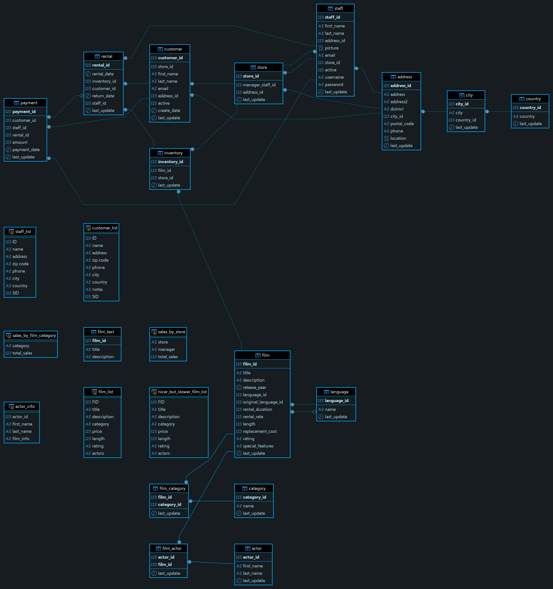

# # Домашнее задание к занятию «Репликация и масштабирование. Часть 1» Петровский А.Н


### Задание 1

На лекции рассматривались режимы репликации master-slave, master-master, опишите их различия.

*Ответить в свободной форме.*

---

<details>
<summary> Решение </summary>

###  Репликация — это механизм синхронизации данных между несколькими экземплярами СУБД. Ниже приведено сравнение двух основных топологий.

### 1. Master-Slave (Источник — Реплика)
Это асимметричная модель управления данными.

* **Принципы:**
    * **Master (Ведущий):** Единственный узел, принимающий запросы на изменение данных (`INSERT`, `UPDATE`, `DELETE`).
    * **Slave (Ведомый):** Получает изменения от Master и обслуживает запросы на чтение (`SELECT`).
* **Различия:**
    * **Направление потока:** Данные всегда текут строго в одну сторону (от Master к Slave).
    * **Конфликты:** Отсутствуют по определению, так как источник записи один.
    * **Назначение:** Идеально подходит для масштабирования чтения и создания резервных копий без остановки основной базы.

### 2. Master-Master (Multi-Master)
Это симметричная модель, где каждый узел обладает равными правами.

* **Принципы:**
    * Любой узел в кластере может принимать как чтение, так и запись.
    * Изменения на одном узле автоматически транслируются на все остальные.
* **Различия:**
    * **Направление потока:** Двунаправленное (Full mesh или кольцо).
    * **Конфликты:** Возможны коллизии (например, одновременное изменение одной строки на разных узлах). Требуются сложные механизмы разрешения конфликтов.
    * **Назначение:** Обеспечение высокой доступности (High Availability) на запись и отказоустойчивость при выходе из строя любого узла.

---
 ----------

 ## 📊 ER-диаграмма базы данных (Sakila DB)

Для визуализации структуры восстановленной базы данных была сформирована ER-диаграмма. 



*   **Количество таблиц**: 23
*   **Связи**: Полностью сохранены согласно дампу (Foreign Keys, Indexes). 

> **Примечание:** Весь процесс запускается одной командой: `make deploy`.

</details>


### Задание 2
Составьте таблицу, используя любой текстовый редактор или Excel, в которой должно быть два столбца: в первом должны быть названия таблиц восстановленной базы, во втором названия первичных ключей этих таблиц. Пример: (скриншот/текст)
```
Название таблицы | Название первичного ключа
customer         | customer_id
```


### Решение

Ниже представлена таблица соответствия всех физических таблиц базы данных **Sakila** и их первичных ключей. 

> **Примечание**: В списке отсутствуют объекты-представления (Views), такие как `actor_info` или `film_list`, так как они являются виртуальными таблицами и не имеют собственных первичных ключей.

| Название таблицы | Название первичного ключа |
| :--- | :--- |
| **actor** | `actor_id` |
| **address** | `address_id` |
| **category** | `category_id` |
| **city** | `city_id` |
| **country** | `country_id` |
| **customer** | `customer_id` |
| **film** | `film_id` |
| **film_actor** | `actor_id`, `film_id` (составной PK) |
| **film_category** | `film_id`, `category_id` (составной PK) |
| **film_text** | `film_id` |
| **inventory** | `inventory_id` |
| **language** | `language_id` |
| **payment** | `payment_id` |
| **rental** | `rental_id` |
| **staff** | `staff_id` |
| **store** | `store_id` |

**Метод верификации**:
Данные получены путем анализа структуры таблиц через IDE и выполнения SQL-запроса к системной таблице `information_schema.KEY_COLUMN_USAGE`.
